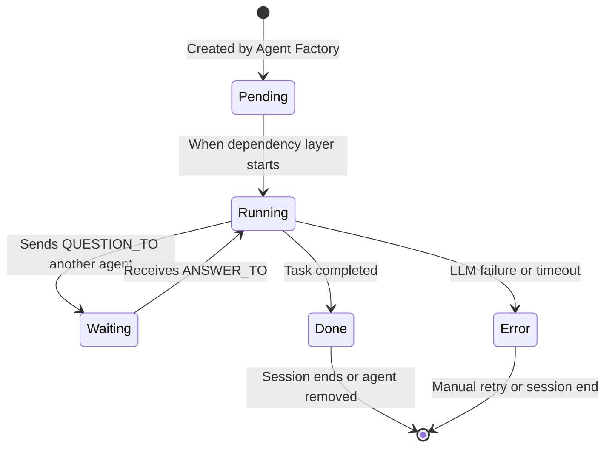

# 🤖 AgentOS Agent System

> The intelligent workforce that turns your vision into execution.

In AgentOS, agents are specialized AI entities that collaborate to achieve your goals. Unlike static templates, agents are dynamically generated based on your description, each with a defined role, expertise, and purpose within the organizational hierarchy.

---

## 🧬 Agent Lifecycle

Every agent follows this lifecycle within a session:



### Phases Explained

1. **Pending** - Agent created but waiting for its dependency layer to execute
2. **Running** - Actively processing its task via assigned LLM
3. **Waiting** - Paused, awaiting response to a `QUESTION_TO:[Agent]` query
4. **Done** - Task completed; output stored in database
5. **Error** - Failed execution (timeout, API error, etc.)

---

## 👥 Role Generation & Assignment

### How Roles Are Determined

The **Global Orchestrator** (a Layer 0 AI) analyzes your description to infer necessary roles:

| Description Keywords | Likely Roles Generated |
|----------------------|------------------------|
| "fintech", "banking", "payments" | CEO, CTO, Legal Counsel, Compliance Officer, Finance Lead |
| "social media", "community", "content" | CEO, CTO, Marketing Director, Community Manager, Product Manager |
| "e-commerce", "retail", "store" | CEO, CTO, CPO (Chief Product Officer), Marketing Lead, Logistics Manager |
| "saas", "platform", "api" | CEO, CTO, Lead Developer, UX Designer, Customer Success Manager |
| "healthcare", "medical", "hipaa" | CEO, CTO, Legal Counsel (HIPAA specialist), Operations Lead, Research Lead |
| "game", "gaming", "entertainment" | CEO, CTO, Game Designer, Lead Developer, Marketing Director, Community Manager |

### Role Properties

Each agent has these configured attributes:

- **`role`** - Functional title (e.g., "CTO", "Marketing Director")
- **`display_name`** - Human-readable identifier (e.g., "Alex Chen - CTO")
- **`model`** - Assigned LLM (see [Model Assignment](#model-assignment))
- **`system_prompt`** - Role-specific instructions + constraints + personality
- **`task`** - Specific objective assigned to this agent
- **`layer`** - Dependency depth (0 = independent strategists, 1+ = dependents)
- **`status`** - Current lifecycle state (Pending/Running/etc.)

---

## 🔗 Inter-Agent Communication

Agents collaborate via a structured message protocol embedded in their outputs.

### Message Format

Agents embed questions and answers directly in their reasoning:

```
QUESTION_TO:[CTO]What is the maximum concurrent users our architecture can support?END_QUESTION

ANSWER_TO:[CEO]Re: concurrent users — Based on current cloud budget, we can support 10,000 simultaneous connections with auto-scaling.END_ANSWER
```

### Message Object Structure

Stored in the `messages` table:

| Field | Type | Description |
|-------|------|-------------|
| `message_id` | TEXT | Unique UUID |
| `session_id` | TEXT | Parent session reference |
| `from_agent` | TEXT | Sender agent ID |
| `to_agent` | TEXT | Receiver agent ID |
| `type` | TEXT | `'question' | 'answer' | 'info'` |
| `content` | TEXT | The actual message content |
| `resolved` | BOOLEAN | Whether question received answer |
| `timestamp` | DATETIME | When message was sent |

### Communication Rules

- **Max 3 question rounds** per agent to prevent infinite loops
- **60-second timeout** per question — if unanswered, agent proceeds with assumptions
- **Circular dependencies blocked** — System prevents A→B and B→A waiting chains
- **Priority queuing** — Higher-layer agents (closer to synthesis) get message priority
- **Real-time visibility** — All messages broadcast via WebSocket to frontend activity feed

---

## ⚙️ Model Assignment

### Automatic Selection

The Global Orchestrator assigns models based on role requirements:

| Model | Best For | Strengths |
|-------|----------|-----------|
| **Gemini 1.5 Pro** | Frontend Dev, Designer, Marketing | Creative, multimodal, long context (2M tokens) |
| **Kimi K2 (NVIDIA NIM)** | CEO, CTO, Architect, Analyst | Complex reasoning, strategy, structure |
| **GPT-4o (OpenAI)** | Legal, HR, Compliance, Finance | Precise, fact-aware, reliable |
| **Claude Sonnet (Anthropic)** | QA, Documentation, Code Review | Careful, analytical, safe outputs |
| **Llama 3.1 70B (NVIDIA NIM)** | Developer, DevOps, Backend | Fast, cost-efficient, code-capable |

### Assignment Logic

```python
def select_model(role: str, user_override: str = None) -> str:
    if user_override:
        return user_override  # User choice always wins
    
    role_lower = role.lower()
    ROLE_MODEL_MAP = {
        "frontend": "gemini-1.5-pro",
        "design": "gemini-1.5-pro",
        "marketing": "gemini-1.5-pro",
        "backend": "llama-3.1-70b",
        "devops": "llama-3.1-70b",
        "strategy": "kimi-k2",
        "architecture": "kimi-k2",
        "analysis": "kimi-k2",
        "legal": "gpt-4o",
        "compliance": "gpt-4o",
        "finance": "gpt-4o",
        "hr": "gpt-4o",
        "qa": "claude-sonnet",
        "testing": "claude-sonnet",
        "code_review": "claude-sonnet",
        "default": "kimi-k2"
    }
    
    for key, model in ROLE_MODEL_MAP.items():
        if key in role_lower:
            return model
    
    return ROLE_MODEL_MAP["default"]
```

### User Overrides

Users can manually override any agent's model mid-execution via:
- Frontend agent panel dropdown
- `PATCH /api/agents/{id}/model` endpoint
- Overrides persist for the session and are stored in the database

---

## 🏗️ Agent Creation Process

When a session is created:

1. **Global Orchestrator Runs**
   - Prompt: *"Act as an HR Manager. Based on this description: '[user description]', infer necessary roles, define their expertise, constraints, and optimal model assignments."*
   - Output: JSON array of agent definitions

2. **Agent Factory Execution**
   For each agent definition:
   - Builds customized `system_prompt`: `[Role] persona + [task-specific instructions] + [behavioral constraints]`
   - Assigns model via `select_model()` (unless user override provided)
   - Creates agent database entry with:
     - Unique `agent_id` (UUID)
     - `session_id` foreign key
     - Initial `status` = 'pending'
     - Empty `output` field

3. **Dependency Mapping**
   - The Orchestrator also defines `dependencies` (agent_ids this agent waits on)
   - Determines `layer` (0 for no dependencies, increment for each dependency depth)
   - Stores task-specific `objective` in the `task` field

---

## 📊 Agent Output & Results

### During Execution
- Live token streaming via WebSocket (`agent_token` events)
- Status updates broadcast (`agent_started`, `agent_done`)
- Messages visible in real-time activity feed

### Upon Completion
- Final output stored in `agents.output` field
- Contributes to session context for dependent agents
- Available in final results aggregation

### Result Types by Role

| Role | Typical Output |
|------|----------------|
| **CEO** | Strategic vision, success metrics, risk assessment |
| **CTO** | Technical architecture, tech stack, scalability plan |
| **Product Manager** | Feature roadmap, user stories, MVP definition |
| **Lead Developer** | Implementation plan, API design, database schema |
| **Marketing Director** | Go-to-market strategy, customer acquisition, branding |
| **Legal Counsel** | Compliance requirements, IP considerations, terms of service |
| **Finance Lead** | Financial projections, budget allocation, pricing strategy |
| **UX Designer** | Wireframes, user flows, accessibility guidelines |
| **DevOps Engineer** | Deployment architecture, CI/CD pipeline, monitoring plan |

---

## 🔄 Session Persistence & Resumption

All agent data persists in SQLite:

- **Agent State** - `status`, `output`, `completed_at` stored in `agents` table
- **Message History** - All `QUESTION_TO`/`ANSWER_TO` exchanges in `messages` table
- **Context Preservation** - When resuming a session:
  - All agents restore to their exact previous state
  - Waiting agents remain waiting for pending questions
  - Completed agents' outputs are available as context
  - User can modify agents (change model, edit task) and re-run selectively

### Example Resumption Flow
1. User returns to completed session "SaaS Startup Plan"
2. Frontend loads all agents with their Done status and outputs
3. User changes Lead Developer's model from Llama to GPT-4o
4. User clicks "Re-run Agent" on Lead Developer
5. System:
   - Sets Lead Developer status to Pending → Running
   - Provides all Layer 0 outputs (CEO, CTO, etc.) as context
   - Streams new tokens in real-time
   - Updates output upon completion
   - Triggers dependent agents (if any) to re-run with new context

---

## 🎯 Best Practices for Effective Agents

### For Role Clarity
- Be specific in descriptions: "Build a HIPAA-compliant telehealth platform for rural clinics" generates better agents than "Make a healthcare app"
- Mention key constraints: budget, timeline, team size, regulatory needs
- Specify target audience: "for enterprise B2B" vs "for Gen Z consumers"

### For Better Collaboration
- The system naturally creates checks and balances (e.g., Legal questions Marketing claims)
- Agents will surface missing information via questions
- Review the message flow to see how consensus emerges

### For Optimal Results
- Start with a clear, concise description (1-2 sentences)
- Let the system generate agents, then refine via model overrides if needed
- Use the export feature to download JSON/Markdown blueprints for further planning

---

## 📁 Related Files

- [`agent.md`] - Antygravity agent specifications & memory architecture (1M+ codebase navigation)
- [`design.md`] - Antygravity GraphRAG system design (Neo4j + Qdrant memory engine)
- [`project_doc.txt`] - End-to-end project document (4-Day Build Plan, agent lifecycle details)

<small>Last updated: August 22, 2026</small>