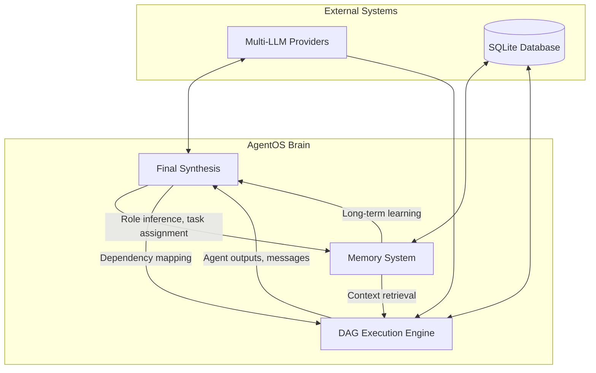
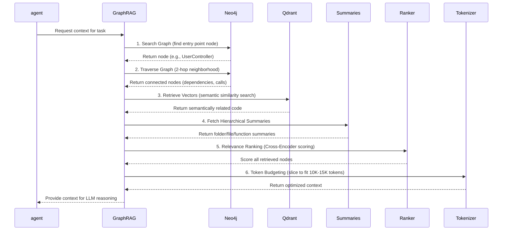

# 🧠 AgentOS Brain System

> The cognitive core that orchestrates intelligent AI organizations.

The "Brain" of AgentOS encompasses the sophisticated orchestration, reasoning, and memory systems that enable dynamic agent generation, intelligent collaboration, and context-aware execution. This is where raw language transforms into structured AI workforce behavior.

---

## 🎯 Core Components

AgentOS Brain consists of four interconnected systems:



### 1. Global Orchestrator (Layer 0 AI)
The master reasoning engine that:
- Infers necessary agent roles from user description
- Creates customized system prompts for each role
- Assigns optimal LLM models based on role requirements
- Builds the task dependency graph (DAG)
- Performs final synthesis of all agent outputs

### 2. Memory System
A four-tier cognitive architecture that provides context at different timescales:
- **Session Memory** (Short-term) - Current task context
- **Project Memory** (Mid-term) - Repository-specific knowledge
- **Architectural Memory** (Long-term) - Team-established patterns & constraints
- **Execution Memory** (Experience) - Historical edits, bugs, decisions

### 3. DAG Execution Engine
The parallel processing core that:
- Groups agents by dependency layers
- Executes layers simultaneously using asyncio
- Manages inter-agent communication flow
- Handles timeouts, retries, and error states

### 4. Final Synthesis Engine
The Orchestrator's concluding role that:
- Aggregates all agent outputs
- Resolves conflicts and inconsistencies
- Generates the final business blueprint/report
- Prepares exportable formats (JSON/Markdown)

---

## 🔬 The Four-Tier Memory System

Inspired by senior human engineers' cognition, AgentOS maintains context across multiple timescales:

### 3.1 Session Memory (Short-Term)
**Purpose**: Holds immediate conversational context and active coding task
**Contents**:
- Current user prompt and description
- Active files/concepts in focus
- Recent terminal outputs and tool usages
- Step-by-step execution plan currently underway
**Storage**: In-memory (cleared after task completion or session reset)
**Retrieval**: Always available; forms the working context for LLM prompts

### 3.2 Project Memory (Mid-Term)
**Purpose**: Repository-specific knowledge for the current codebase
**Contents**:
- Directory structures and module boundaries
- Active feature flags and environment variables
- Detected technical debt and test coverage gaps
- Known APIs, database schemas, and service boundaries
**Storage**: 
- Structural: Neo4j graph (files → classes → functions → relationships)
- Semantic: Qdrant vector embeddings (code meaning and docstrings)
**Retrieval**: GraphRAG engine (6-step pipeline) for token-efficient context

### 3.3 Architectural Memory (Long-Term)
**Purpose**: High-level design patterns and constraints established by team
**Contents**:
- Coding standards and conventions ("We use Redux, not React Context")
- Mandatory architectural layers ("All DB queries go through Repository")
- Prohibited practices ("No direct DOM manipulation in React")
- Preferred libraries and frameworks
**Storage**: Summarized guidelines retrieved via GraphRAG during planning
**Update Mechanism**: Agents can store new rules via `POST /memory/store`

### 3.4 Execution Memory (Experience)
**Purpose**: Historical log of edits, bugs, and design decisions
**Contents**:
- Past GitHub Issues/PRs linked to specific code changes
- Historical AgentOS sessions and their outcomes
- Known performance issues and their resolutions
- Successful patterns and anti-patterns discovered
**Storage**: 
- Graph nodes connecting code files to past events
- Edges labeled with outcome ("fixed", "caused_issue", "performance_improvement")
**Retrieval**: Contextualized when editing related code ("In PR #402...")

---

## 🔄 The 6-Step GraphRAG Retrieval Engine

When an agent needs context, the Brain executes this precisely engineered pipeline to stay under 15,000 tokens:



#### Step Details

1. **Search Graph** 
   - Identify entry point from task (e.g., "validate email" → `validateEmail()` function)
   - Uses exact matches, fuzzy search, or semantic similarity in Neo4j

2. **Traverse Graph**
   - Walk 2 hops out from entry point in Neo4j
   - Follows `[:CALLS]`, `[:IMPORTS]`, `[:IMPLEMENTS]`, `[:CONTAINS]` relationships
   - Finds all direct dependencies and callers

3. **Retrieve Vectors**
   - Similarity search in Qdrant for structurally disconnected but semantically related code
   - Example: Finding frontend React component that calls a backend API
   - Uses AST-preserved semantic chunks (not blind character splitting)

4. **Fetch Summaries**
   - Get hierarchical summaries for broader context:
     - Function: "Validates user email format with regex"
     - File: "Contains authentication utility functions"
     - Folder: "Handles user authentication and security middleware"
     - Repository: "Node.js REST API for e-commerce platform"

5. **Relevance Ranking**
   - Score all retrieved nodes using Cross-Encoder models
   - Penalize low-relevance context, boost highly pertinent code
   - Considers both structural importance and semantic similarity

6. **Token Budgeting**
   - Slice ranked results to fit strictly under target token limit
   - Preserve high-priority context (entry point, direct dependencies)
   - Discard low-priority context first (distant ancestors, tangential siblings)
   - Maintains < 10,000-15,000 tokens average per prompt

---

## ⚙️ DAG Execution Engine Deep Dive

The engine that turns agent definitions into coordinated action:

### Layer-Based Scheduling
Agents are grouped by dependency depth:
- **Layer 0**: No dependencies (independent strategists: CEO, CTO, Legal)
- **Layer 1**: Depend only on Layer 0 (executors: Developers, Marketers)
- **Layer 2**: Depend on Layers 0 & 1 (synthesizers: Final consolidators)
- **Higher Layers**: Rare; used for complex multi-stage reasoning

### Execution Pattern
```python
async def execute_dag(session_id: str, agents: List[Agent]):
    layers = build_dependency_layers(agents)  # Group by dependency depth
    
    for layer_num, layer_agents in enumerate(layers):
        # 1. Broadcast layer start
        await ws_broadcast(session_id, {
            "event": "layer_start",
            "layer": layer_num,
            "agents": [a.role for a in layer_agents]
        })
        
        # 2. Execute all agents in layer simultaneously
        tasks = [execute_agent(agent, session_id) for agent in layer_agents]
        results = await asyncio.gather(*tasks, return_exceptions=True)
        
        # 3. Process inter-agent messages from this layer
        await process_messages(session_id, layer_agents)
        
        # 4. Layer complete - outputs available as context for next layer
```

### Agent Execution
Each `execute_agent` call:
1. Builds LLM prompt: `[system_prompt] + [session context] + [layer outputs] + [task]`
2. Calls assigned LLM API with streaming enabled
3. Streams tokens to WebSocket in real-time
4. Parses output for `QUESTION_TO:`/`ANSWER_TO:` embeddings
5. Stores final output in database upon completion
6. Handles timeouts (60s default) and retries (configurable)

### Message Processing
- Parses all agent outputs for message embeddings
- Routes `QUESTION_TO:[AgentID]` to target agent's context
- Matches `ANSWER_TO:[AgentID]` to pending questions
- Updates `messages.resolved` flag when answered
- Broadcasts all messages via WebSocket for frontend visibility

---

## 🧠 Final Synthesis Process

After all agents complete, the Global Orchestrator performs final synthesis:

### Input Collection
- Gathers all `agents.output` from database
- Retrieves all `messages` for context and collaboration insight
- Collects session metadata (description, timestamps, etc.)

### Synthesis Prompt
The Orchestrator runs with a prompt like:
```
Act as a Chief of Staff synthesizing an executive briefing.
You have received reports from:
- CEO: [CEO output]
- CTO: [CTO output] 
- Product Manager: [PM output]
- Lead Developer: [Dev output]
- Marketing Director: [Marketing output]
- Legal Counsel: [Legal output]
- [etc.]

The original goal was: "[user description]"

Create a cohesive business blueprint that:
1. Resolves any conflicting recommendations
2. Highlights key decisions and trade-offs
3. Presents a clear, actionable plan
4. Identifies risks and mitigation strategies
5. Defines success metrics and next steps
```

### Output Formats
Results are stored and available as:
- **JSON**: Structured data for programmatic consumption
- **Markdown**: Human-readable report with sections and formatting
- **Both** include:
  - Executive summary
  - Individual agent contributions
  - Key decisions and rationale
  - Implementation roadmap
  - Risk assessment
  - Success metrics
  - Full message transcript (optional)

---

## 🚀 Performance & Scaling

### Token Efficiency
- **Average context per agent**: < 12,000 tokens
- **Context for entry-point agents**: Often < 5,000 tokens (highly focused)
- **Hierarchical summarization** prevents prompt bloat in large codebases

### Latency Targets
- **Graph traversal** (3-hop Neo4j query): < 500ms
- **Retrieval pipeline** (end-to-end): < 2 seconds
- **Agent execution** (LLM call): Model-dependent but streamed
- **Full session** (typical 5-agent org): 60-180 seconds

### Scale Capacity
- **Codebase size**: 1,000,000+ Lines of Code supported
- **Concurrent sessions**: Limited by hardware and LLM rate limits
- **Agents per session**: Practically 2-10 (more creates diminishing returns)
- **Message rounds**: Self-limiting via 3-question max per agent

---

## 🔮 Future Enhancements

### Planned Brain Upgrades
1. **Dynamic Layer Adjustment** - Reorganize layers mid-execution based on discoveries
2. **Confidence Scoring** - Agents report certainty; low confidence triggers research subagents
3. **Meta-Reasoning** - Orchestrator reflects on its own role assignments and improves
4. **Knowledge Distillation** - Session insights automatically update Architectural Memory
5. **Predictive Pre-fetching** - Anticipate needed context and pre-warm caches

### Integration Roadmap
- **Antygravity GraphRAG v2** - Enhanced semantic understanding with code execution traces
- **Multi-modal Input** - Accept diagrams, sketches, or prototypes as description seeds
- **Simulation Mode** - Run "what-if" scenarios by adjusting agent parameters
- **Agent Marketplace** - Share and reuse effective agent configurations across teams

---

## 📁 Technical References

- [`agent.md`] - Detailed 4-tier memory system specifications
- [`design.md`] - GraphRAG memory engine architecture (Neo4j + Qdrant)
- [`project_doc.txt`] - End-to-end project document (Global Orchestrator specs, DAG engine)
- [`Agents.md`] - Agent lifecycle, roles, and communication protocols

<small>Last updated: August 22, 2026</small>