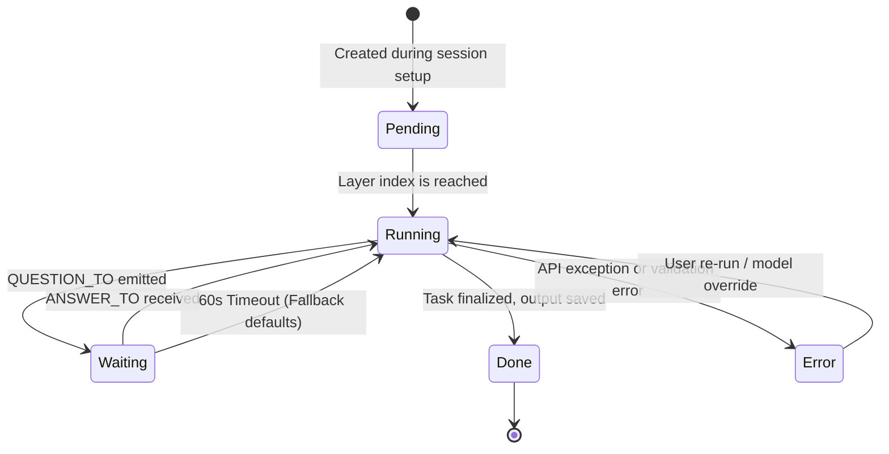
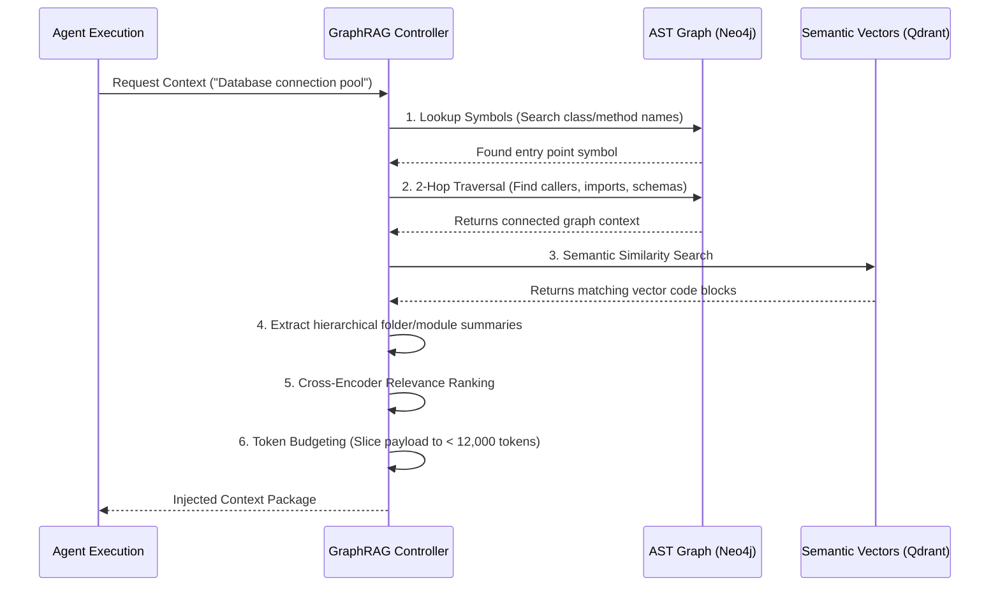

# ⚡ AgentOS — AI Organization Operating System

> Deploy a collaborative, multi-agent AI organization from plain text in under 5 minutes — no code required.

AgentOS transforms your business vision, startup idea, or project description into an executing AI workforce. By describing your goal in natural language, AgentOS automatically generates a hierarchy of specialized AI agents (e.g., CEO, CTO, Product Manager, Lead Developer, Marketing Director, Legal Counsel) that collaborate in real-time via a structured message bus to deliver comprehensive business blueprints.

Unlike complex developer agent frameworks requiring massive engineering overhead (like LangGraph or CrewAI), or enterprise solutions (like IBM watsonx or Salesforce Agentforce) costing millions, AgentOS fills the consumer gap: a no-code platform where anyone can deploy an AI organization in under 5 minutes.

---

## 📖 Table of Contents

- [✨ Core Features](#-core-features)
- [🏗️ System Architecture](#️-system-architecture)
- [📁 Project Folder Structure](#-project-folder-structure)
- [🧬 Agent Lifecycle & State Machine](#-agent-lifecycle--state-machine)
- [🧠 Cognitive 4-Tier Memory System](#-cognitive-4-tier-memory-system)
- [🔍 The 6-Step GraphRAG Retrieval Engine](#-the-6-step-graphrag-retrieval-engine)
- [⚙️ Model Selection & Routing Matrix](#️-model-selection--routing-matrix)
- [💾 Database Schema (SQLite)](#-database-schema-sqlite)
- [🔌 REST API Endpoints Reference](#-rest-api-endpoints-reference)
- [🌐 WebSocket Event Reference](#-websocket-event-reference)
- [🚀 Step-by-Step Installation & Run Guide](#-step-by-step-installation--run-guide)
  - [Prerequisites](#prerequisites)
  - [Local Development Setup](#local-development-setup)
  - [Running with Docker Compose](#running-with-docker-compose)
- [🔮 Future Roadmap](#-future-roadmap)

---

## ✨ Core Features

- **Dynamic Role Inference & Generation**: Analyzes startup/project descriptions via Gemini to automatically construct 4–6 custom agent roles, tailored tasks, system instructions, and layered structures. No predefined templates required.
- **Parallel Asyncio DAG Execution**: Groups agents into dependency layers (e.g., Layer 0 Strategists, Layer 1 Execution Specialists) and executes them concurrently using Python's asynchronous event loops (`asyncio.gather`).
- **Inter-Agent Message Bus Protocol**: Supports structured `QUESTION_TO:[Role]` and `ANSWER_TO:[Role]` protocols embedded directly in agent execution loops to simulate collaborative consensus.
- **Real-Time Token Streaming**: Streams agent outputs word-by-word over WebSockets to provide instant visibility into ongoing reasoning processes.
- **High-Fidelity React Cockpit**: A modern dashboard containing real-time workspace animations, live typing deltas, aggregate token savings, and model override selectors.
- **Comprehensive Session Persistence**: Restores, reviews, and overrides models for past execution histories via SQLite storage.

---

## 🏗️ System Architecture

AgentOS follows a decoupled, layered architecture:

```mermaid
graph TD;
    subgraph Frontend [Presentation Layer (React + Vite)]
        UI[Interactive Workbench] <--> WS_Client[WebSocket Client]
        UI <--> REST_Client[API Fetch Client]
    end

    subgraph Backend [Application Layer (FastAPI)]
        API[FastAPI Endpoints] <--> WS_Manager[WebSocket Manager]
        API <--> Engine[DAG Execution Engine]
        Engine <--> MsgBus[Inter-Agent Message Bus]
        Engine <--> Memory[4-Tier Memory System]
    end

    subgraph AI [Model Router Layer]
        Router[Dynamic Model Router] --> Gemini[Gemini Pro / Flash]
        Router --> Kimi[Kimi K2 NVIDIA NIM]
        Router --> GPT4[GPT-4o]
        Router --> Llama[Llama 3.1 NIM]
    end

    subgraph DB [Persistence Layer]
        SQLite[(SQLite Database)]
    end

    REST_Client <--> API
    WS_Client <--> WS_Manager
    Engine <--> Router
    API <--> SQLite
    Engine <--> SQLite
```

---

## 📁 Project Folder Structure

An overview of the files making up the AgentOS project:

```
AgentOS/
├── backend/
│   ├── main.py                  # FastAPI entry point, DB setup, & execution loops
│   ├── websocket_manager.py     # Real-time WebSocket connection manager
│   ├── requirements.txt         # Python dependencies
│   ├── agentos.db               # SQLite database file (created on startup)
│   ├── repositories/
│   │   └── decision_repository.py  # SQLite database data access layer
│   ├── routes/
│   │   ├── decisions.py         # REST endpoints for decision workflows
│   │   ├── tasks.py             # REST endpoints for user task dispatches
│   │   └── analytics.py         # REST endpoints for performance metrics
│   ├── schemas/
│   │   └── decision.py          # Pydantic schemas for data validation
│   ├── services/
│   │   ├── decision_service.py  # Core business logic for sessions and decisions
│   │   ├── decision/
│   │   │   ├── consensus_engine.py  # Scores alternatives against stakeholder values
│   │   │   └── constraint_engine.py # Validates options against hard/soft rules
│   │   ├── negotiation/
│   │   │   └── negotiation_engine.py # Implements multi-round agent negotiations
│   │   └── orchestration/
│   │       └── task_classifier.py    # Classifies user prompts for agent routing
│   └── tests/
│       ├── test_decision.py     # Unit/Integration tests for decision lifecycle
│       └── test_spark.py        # Unit/Integration tests for workspaces & engines
├── spark-prototype/             # React Frontend application
│   ├── package.json             # Node dependencies and build scripts
│   ├── index.html               # Main HTML wrapper
│   ├── vite.config.mjs          # Vite compilation properties
│   ├── Dockerfile               # Frontend containerization properties
│   ├── nginx.conf               # Reverse proxy for serving production assets
│   ├── src/
│   │   ├── main.jsx             # React entry point
│   │   ├── App.jsx              # Workspace Dashboard UI & telemetry panels
│   │   ├── Landing.jsx          # Setup, description input, & session load screen
│   │   ├── styles.css           # Custom theme design tokens & visual aesthetics
│   │   └── services/
│   │       ├── api.js           # REST API client configurations
│   │       └── websocket.js     # Native browser WebSocket adapter
│   └── tests/
│       └── sites-worker.test.mjs # Frontend integration worker test suite
├── docker-compose.yml           # local multi-container orchestration spec
└── README.md                    # Project documentation
```

---

## 🧬 Agent Lifecycle & State Machine

Each agent in AgentOS is structured around a state machine governed by the DAG execution engine.



- **`Pending`**: Waiting for parents or preceding layers to resolve.
- **`Running`**: Actively executing its specific task, streaming text tokens to the frontend WebSocket channel.
- **`Waiting`**: Paused dynamically because it requested input from another agent. Resumes when the response arrives or the 60-second timeout expires.
- **`Done`**: Report stored in database and injected as context for the next DAG layer.
- **`Error`**: Execution halted due to network timeout or rate limits.

---

## 🧠 Cognitive 4-Tier Memory System

AgentOS leverages a senior-engineer-style memory model spanning four distinct timescales:

1. **Session Memory (Short-Term)**: Tracks the active prompt, active files/concepts in focus, recent execution errors, and the current task checklist (`task.md`).
2. **Project Memory (Mid-Term)**: Contains codebase-wide index structures mapping relationships (Neo4j syntax tree) alongside AST-aware vector embeddings (Qdrant semantic index) to coordinate large directory manipulations.
3. **Architectural Memory (Long-Term)**: Stores team guidelines, security constraints, and forbidden anti-patterns (*e.g., "Always route DB queries through the repository layer"*).
4. **Execution Memory (Experience Layer)**: Connects code files to historical PRs, bug repair traces, and diagnostic scores to prevent regressions.

---

## 🔍 The 6-Step GraphRAG Retrieval Engine

When performing reasoning or generating blueprint reports, the AgentOS Brain runs an optimized GraphRAG pipeline to keep context scopes within token budgets:



---

## ⚙️ Model Selection & Routing Matrix

The backend dynamically maps roles to the best LLMs based on their capabilities, but users can override this selection dynamically in the UI cockpit:

| Model ID | Provider | Recommended Roles | Key Strengths |
| :--- | :--- | :--- | :--- |
| **`gemini-1.5-flash`** | Google AI Studio | Search Specialist, Content Creator, Analytics Engineer | Speed, low cost, multimodal context parsing. |
| **`gemini-1.5-pro`** | Google AI Studio | UX Designer, Frontend Lead, Marketing Director | Creative visual logic, massive context window (2M tokens). |
| **`kimi-k2`** | NVIDIA NIM | CEO, CTO, Software Architect | Complex logic, reasoning depth, planning long documents. |
| **`gpt-4o`** | OpenAI | Legal Counsel, Compliance Officer, CFO | Precision rules, strict schema compliance, numeric accuracy. |
| **`llama-3.1-70b`** | NVIDIA NIM / Local | Lead Backend Developer, DevOps Admin | High performance code generation, robust structured JSON outputs. |

---

## 💾 Database Schema (SQLite)

The system persists execution records locally in `backend/agentos.db`. The primary tables include:

```sql
-- Track overall session attributes and user goals
CREATE TABLE sessions (
    id TEXT PRIMARY KEY,
    description TEXT NOT NULL,
    status TEXT DEFAULT 'draft',
    user_id TEXT,
    created_at TEXT DEFAULT CURRENT_TIMESTAMP,
    updated_at TEXT DEFAULT CURRENT_TIMESTAMP
);

-- Track individual agent definitions, instructions, models, and outputs
CREATE TABLE agents (
    id TEXT PRIMARY KEY,
    session_id TEXT REFERENCES sessions(id) ON DELETE CASCADE,
    role TEXT NOT NULL,
    display_name TEXT,
    model TEXT NOT NULL,
    model_override TEXT,
    system_prompt TEXT,
    task TEXT,
    layer INTEGER DEFAULT 0,
    status TEXT DEFAULT 'pending',
    output TEXT,
    created_at TEXT DEFAULT CURRENT_TIMESTAMP,
    completed_at TEXT
);

-- Track structured communications exchanged between agents
CREATE TABLE messages (
    id TEXT PRIMARY KEY,
    session_id TEXT REFERENCES sessions(id) ON DELETE CASCADE,
    from_agent TEXT REFERENCES agents(id) ON DELETE CASCADE,
    to_agent TEXT REFERENCES agents(id) ON DELETE CASCADE,
    type TEXT, -- 'question' | 'answer' | 'info'
    content TEXT,
    resolved BOOLEAN DEFAULT 0,
    timestamp TEXT DEFAULT CURRENT_TIMESTAMP
);

-- Store finalized synthesis and metrics reports
CREATE TABLE results (
    id TEXT PRIMARY KEY,
    session_id TEXT REFERENCES sessions(id) ON DELETE CASCADE,
    title TEXT,
    summary TEXT,
    synthesis TEXT,
    metrics TEXT, -- JSON string (array of {value, label})
    recommendations TEXT, -- JSON string (array of strings)
    created_at TEXT DEFAULT CURRENT_TIMESTAMP
);
```

---

## 🔌 REST API Endpoints Reference

### 1. Create Session
- **Endpoint**: `POST /api/sessions`
- **Request Body**:
  ```json
  {
    "description": "Create a blockchain-based voting app for municipal elections."
  }
  ```
- **Response** (201 Created):
  ```json
  {
    "session_id": "sess_8a2d1f930e",
    "status": "draft",
    "agents": [
      {
        "agent_id": "agent_0b9c3f4e21",
        "role": "CEO",
        "display_name": "Sarah Jenkins - Chief Executive Officer",
        "model": "kimi-k2",
        "layer": 0,
        "status": "pending",
        "task": "Create the overall strategic business model..."
      }
      // other generated roles
    ]
  }
  ```

### 2. List All Sessions
- **Endpoint**: `GET /api/sessions`
- **Response**: Array of all session objects sorted by creation timestamp.

### 3. Get Session Details
- **Endpoint**: `GET /api/sessions/{session_id}`
- **Response**: Details of the session, including metadata and all associated `agents`.

### 4. Override Agent Model
- **Endpoint**: `PATCH /api/agents/{agent_id}/model`
- **Request Body**:
  ```json
  {
    "model": "gpt-4o"
  }
  ```
- **Response**: `{"status": "success", "agent_id": "...", "model": "gpt-4o"}`

### 5. Run Session DAG
- **Endpoint**: `POST /api/sessions/{session_id}/run`
- **Response**: `{"status": "running"}`. Spawns the background asyncio execution task.

### 6. Get Synthesized Results
- **Endpoint**: `GET /api/sessions/{session_id}/results`
- **Response**: Aggregated final report containing summary metadata, core synthesis, metrics, recommendations, and individual agent markdown outputs.

### 7. Export Blueprint File
- **Endpoint**: `GET /api/sessions/{session_id}/export?format={json|markdown}`
- **Response**: Triggers an attachment download (`agentos-{session_id}.json` or `agentos-{session_id}.md`) containing the synthesized data.

### 8. Delete Session
- **Endpoint**: `DELETE /api/sessions/{session_id}`
- **Response**: `{"status": "success", "session_id": "..."}`

---

## 🌐 WebSocket Event Reference

WebSockets are established at `/ws/sessions/{session_id}`. Below are the events pushed by the server to the client:

#### Layer Start Event
```json
{
  "event": "layer_start",
  "layer": 0,
  "agents": ["CEO", "CTO", "CFO"]
}
```

#### Agent Started Event
```json
{
  "event": "agent_started",
  "agent_id": "agent_0b9c3f4e21"
}
```

#### Token Streaming Event (Streams word-by-word content)
```json
{
  "event": "agent_token",
  "agent_id": "agent_0b9c3f4e21",
  "token": " Market entry constraints"
}
```

#### Inter-Agent Message Event
```json
{
  "event": "message_sent",
  "id": "msg_f3c9e2b10a",
  "session_id": "sess_8a2d1f930e",
  "from_agent": "agent_0b9c3f4e21",
  "to_agent": "agent_1c2d3e4f5a",
  "type": "question",
  "content": "QUESTION_TO:[CTO] What security standards should we apply? END_QUESTION",
  "timestamp": "2026-08-29T13:00:00.000Z"
}
```

#### Agent Done Event
```json
{
  "event": "agent_done",
  "agent_id": "agent_0b9c3f4e21",
  "output_summary": "### Executive Strategic Report... Analyzed business plan roadmap..."
}
```

#### Session Completed Event
```json
{
  "event": "session_done",
  "session_id": "sess_8a2d1f930e"
}
```

---

## 🚀 Step-by-Step Installation & Run Guide

### Prerequisites
- **Python**: Version 3.11 or higher
- **Node.js**: Version 18 or higher (along with `npm`)
- **API Key**: A valid `GEMINI_API_KEY` from Google AI Studio (Highly recommended. If omitted, the system falls back to high-fidelity simulated/mock outputs, letting you test the system offline).

### Local Development Setup

#### 1. Clone the Repository
```bash
git clone https://github.com/mrigeshkoyande/AgentOS.git
cd AgentOS
```

#### 2. Configure Environment Variables
Create a `.env` file at the root or within the `backend/` directory:
```env
GEMINI_API_KEY=your_actual_gemini_api_key_here
```

#### 3. Backend Setup
1. Open a terminal and navigate to `backend/`:
   ```bash
   cd backend
   ```
2. Create and activate a Python virtual environment:
   ```bash
   python -m venv venv
   # On macOS/Linux:
   source venv/bin/activate
   # On Windows (PowerShell):
   .\venv\Scripts\Activate.ps1
   ```
3. Install dependencies:
   ```bash
   pip install -r requirements.txt
   ```
4. Start the development server:
   ```bash
   python main.py
   ```
   *The FastAPI server will boot and start listening at `http://localhost:8000`. It will automatically initialize the database schemas in `backend/agentos.db`.*

#### 4. Frontend Setup
1. Open a new terminal window and navigate to the frontend prototype directory:
   ```bash
   cd spark-prototype
   ```
2. Install Node packages:
   ```bash
   npm install
   ```
3. Start the Vite development server:
   ```bash
   npm run dev
   ```
4. Open your browser and navigate to `http://localhost:5173/` to open the AgentOS cockpit.

---

### Running with Docker Compose

If you have Docker installed, you can build and run both frontend (configured behind an Nginx reverse proxy serving compiled static files) and backend services as single-command containers:

1. From the project root directory, run:
   ```bash
   docker-compose up --build
   ```
2. Once the build completes and services start, open your browser and navigate to `http://localhost/` (default HTTP port 80).

---

## 🔮 Future Roadmap

- **Human-In-The-Loop Feedback**: Allow users to pause agent runs, edit intermediate outputs, or provide direct feedback mid-negotiation before downstream layers execute.
- **Enhanced GraphRAG Execution Traces**: Integrate temporal analysis of git logs (`git log` analysis) into the GraphRAG indexing step to help developer agents understand past PR modifications and context.
- **Enterprise SSO & Multi-Tenant Databases**: Scale the SQLite persistence model to dynamic PostgreSQL schemas with secure token validation (JWT + OAuth2) and permission boundaries.
- **Agent Sandbox Execution**: Integrate secure sandbox environments (WebAssembly/Docker containers) so execution agents can compile, test, and run code scripts, verifying correctness autonomously before final output generation.
- **Marketplace integration**: Share, score, and reuse agent roles, custom tools, and prompt configurations across teams.