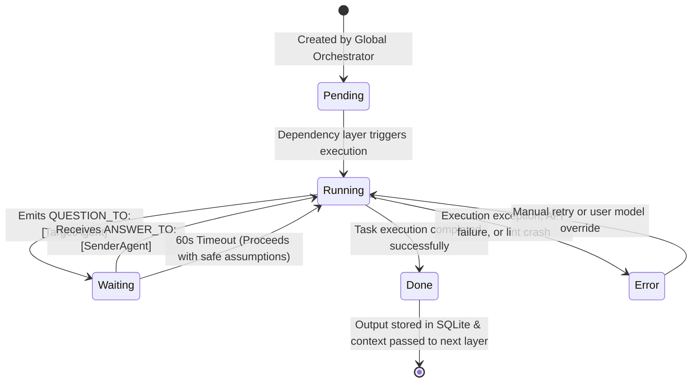
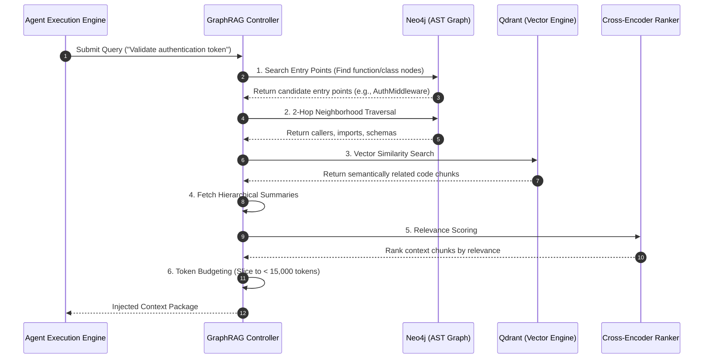

# 🤖 AgentOS Agent Specifications & Architecture Guide

> The comprehensive specification for autonomous AI agent workforces, cognitive 4-tier memory systems, inter-agent communication protocols, and GraphRAG execution loops.

---

## 1. Executive Summary & Core Capabilities

In **AgentOS**, agents are specialized, autonomous AI entities that collaborate in directed acyclic graph (DAG) hierarchies to transform high-level natural language goals into fully articulated business and engineering deliverables. 

Unlike traditional static prompt templates or single-turn coders, AgentOS dynamically infers organizational roles, generates specialized system prompts, assigns optimal LLM models, and establishes multi-agent communication networks. When operating on massive software repositories (>1,000,000 lines of code), AgentOS agents utilize a **Graph-Augmented Retrieval-Augmented Generation (GraphRAG)** memory system to achieve surgical code navigation and token-optimized execution.

```
                             ┌───────────────────────────────────┐
                             │       User Natural Language       │
                             │            Description            │
                             └─────────────────┬─────────────────┘
                                               │
                                               ▼
                             ┌───────────────────────────────────┐
                             │   Layer 0 Global Orchestrator     │
                             └─────────────────┬─────────────────┘
                                               │
                       ┌───────────────────────┴───────────────────────┐
                       ▼                                               ▼
     ┌───────────────────────────────────┐           ┌───────────────────────────────────┐
     │      Strategic Agent Layer        │           │    Cognitive 4-Tier Memory        │
     │   (CEO, CTO, Legal, Compliance)   │           │   (Session, Project, Arch, Exec)  │
     └─────────────────┬─────────────────┘           └─────────────────┬─────────────────┘
                       │                                               │
                       ├───────────────────────┬───────────────────────┤
                       ▼                       ▼                       ▼
             ┌───────────────────┐   ┌───────────────────┐   ┌───────────────────┐
             │ Inter-Agent Bus   │   │ Model Router &    │   │ Self-Healing      │
             │ (Q/A Dialogue)    │   │ Overrides         │   │ Verification      │
             └───────────────────┘   └───────────────────┘   └───────────────────┘
```

### Core Capabilities

- **Dynamic Organizational Role Inference**: Automatically determines required cross-functional roles (e.g., CEO, CTO, Product Manager, Lead Developer, Legal Counsel) based on domain context.
- **4-Tier Cognitive Memory Architecture**: Segregates context across immediate session state, structural/semantic project knowledge, long-term architectural constraints, and historical execution experience.
- **AST-Aware Code Exploration**: Navigates AST syntax trees (Neo4j) combined with vector embeddings (Qdrant) to target exact classes, schemas, and endpoints without token bloat.
- **Parallel Async DAG Execution**: Groups agents into dependency layers executed concurrently via Python's `asyncio.gather`.
- **Inter-Agent Message Protocol**: Enables structured `QUESTION_TO` and `ANSWER_TO` dialogue exchanges directly within reasoning cycles.
- **Self-Healing Verification Loops**: Executes automatic linter/compiler checks and unit test evaluations, recording fix histories to prevent regressions.
- **Dynamic Model Routing & Overrides**: Assigns the ideal LLM provider per role while allowing runtime user overrides.

---

## 2. 🧬 Agent Lifecycle & State Machine

Every agent in AgentOS undergoes a managed lifecycle within a session execution cycle. The engine monitors transitions, handles blocking questions, enforces timeouts, and streams status updates in real-time.



### Lifecycle Phases & State Definitions

| State | Description | Triggers & Actions |
| :--- | :--- | :--- |
| **`Pending`** | Agent is initialized in the database but waiting for prerequisite dependency layers to finish. | Created during session setup; transitions to `Running` when all parent layer agents enter `Done`. |
| **`Running`** | Agent is actively generating tokens via its assigned LLM provider. | Evaluates system prompt, memory context, and inputs; streams character-by-character output via WebSocket (`agent_token`). |
| **`Waiting`** | Agent has paused execution after emitting a `QUESTION_TO:[TargetRole]` query to resolve a dependency ambiguity. | Listens for an `ANSWER_TO` message or resumes automatically after a 60-second safety timeout. |
| **`Done`** | Task execution completed. Output report is finalized and persisted to `agents.output`. | Output is pushed into the workspace context pool for downstream dependency layers and final synthesis. |
| **`Error`** | Execution encountered an unhandled exception, API rate limit, or invalid response. | Halts execution for the specific agent; permits manual retry (`POST /api/agents/{id}/retry`) or model override without restarting the full session. |

---

## 3. 👥 Dynamic Role Generation & Prompt Engineering

### Role Inference Matrix

When a user submits a prompt, the **Global Orchestrator** (Layer 0 AI) infers the necessary cross-functional organizational structure.

| User Domain Keywords | Generated Agent Workforce | Key Objectives & Responsibilities |
| :--- | :--- | :--- |
| **Fintech / Payments** | CEO, CTO, Legal Counsel, Compliance Officer, Finance Lead | Security standards (PCI-DSS), ledger architecture, regulatory risk, unit economics. |
| **SaaS / Enterprise Platform** | CEO, CTO, Product Manager, Lead Developer, Customer Success | Multi-tenant backend, API design, subscription tiers, SLA guarantees. |
| **Healthcare / HealthTech** | CEO, CTO, HIPAA Specialist, Operations Lead, Research Lead | HIPAA compliance, data privacy, EHR integrations, clinical workflow safety. |
| **E-Commerce / Retail** | CEO, CTO, Chief Product Officer, Marketing Lead, Supply Chain | Inventory engine, cart/checkout flows, acquisition funnels, logistics. |
| **Gaming / Metaverse** | CEO, CTO, Game Designer, Lead Developer, Community Lead | Multi-player architecture, economy balancing, asset pipelines, user engagement. |

### Agent Database Entity Schema (`agents`)

Agent definitions are stored in the SQLite `agents` table:

```sql
CREATE TABLE agents (
    id TEXT PRIMARY KEY,           -- Format: agent_uuid
    session_id TEXT NOT NULL,      -- Foreign key to sessions(id)
    role TEXT NOT NULL,            -- Functional title (e.g., "CTO", "Lead Developer")
    display_name TEXT NOT NULL,    -- Label (e.g., "Alex Chen - CTO")
    model TEXT NOT NULL,           -- Assigned default LLM identifier
    model_override TEXT,           -- User-selected model override (if set)
    system_prompt TEXT NOT NULL,   -- Persona instructions + constraints
    task TEXT NOT NULL,            -- Assigned objective
    layer INTEGER NOT NULL,        -- DAG execution depth (0 = Strategist, 1+ = Dependent)
    status TEXT NOT NULL,          -- State: pending | running | waiting | done | error
    output TEXT,                   -- Markdown result payload
    created_at TEXT NOT NULL,      -- Creation timestamp
    completed_at TEXT              -- Completion timestamp
);
```

### System Prompt Engineering Formula

Each agent system prompt is dynamically assembled using four core components:

$$\text{System Prompt} = \text{Persona Identity} + \text{Domain Expertise} + \text{Architectural Constraints} + \text{Output Schema Rules}$$

```markdown
You are the [Role, e.g., Chief Technology Officer] of an innovative software organization.

=== RESPONSIBILITIES ===
- Define technical architecture and tech stack parameters.
- Ensure scalability, maintainability, and security compliance.

=== CONSTRAINTS ===
- Do not introduce unvetted third-party dependencies.
- Follow established architectural memory guidelines.

=== COMMUNICATION PROTOCOL ===
- If you require information from another role, output:
  QUESTION_TO:[Role]Your specific question here...END_QUESTION
- When answering a question, output:
  ANSWER_TO:[Role]Your answer details...END_ANSWER
```

---

## 4. 🧠 The 4-Tier Cognitive Memory Architecture

To replicate the memory management of senior staff engineers, AgentOS structures memory into four distinct layers operating across different timescales:

```
  ┌────────────────────────────────────────────────────────┐
  │              4.1 Session Memory (Short-Term)           │
  │  - Active user instruction, open file handles, checklist│
  │  - Storage: Redis / Fastify In-Memory State            │
  └──────────────────────────┬─────────────────────────────┘
                             ▼
  ┌────────────────────────────────────────────────────────┐
  │              4.2 Project Memory (Mid-Term)             │
  │  - AST Graph (Neo4j) & Semantic Vector Embeddings      │
  │  - Storage: Neo4j (Structural) + Qdrant (Semantic)     │
  └──────────────────────────┬─────────────────────────────┘
                             ▼
  ┌────────────────────────────────────────────────────────┐
  │           4.3 Architectural Memory (Long-Term)         │
  │  - Team conventions, design patterns, security rules   │
  │  - Storage: Persistent SQLite / Configuration Rules    │
  └──────────────────────────┬─────────────────────────────┘
                             ▼
  ┌────────────────────────────────────────────────────────┐
  │            4.4 Execution Memory (Experience)           │
  │  - Commit history, past bug repairs, performance logs  │
  │  - Storage: Neo4j Transaction Graph Nodes              │
  └────────────────────────────────────────────────────────┘
```

### 4.1 Session Memory (Short-Term)
- **Scope**: Current conversational context and active execution step.
- **Contents**: User task prompt, open IDE workspace buffers, terminal execution logs, active task checklist (`task.md`).
- **Storage**: Fastify/Redis in-memory store. Cleared or archived upon session completion.

### 4.2 Project Memory (Mid-Term)
- **Scope**: Repository-wide codebase comprehension for 1M+ LOC codebases.
- **Contents**:
  - **Structural Sub-Layer (Neo4j Graph)**: AST nodes representing files, classes, methods, endpoints, database schemas, and relationships (`[:CALLS]`, `[:IMPORTS]`, `[:IMPLEMENTS]`).
  - **Semantic Sub-Layer (Qdrant Vector Store)**: High-dimensional embeddings of parsed code units and docstrings.
- **Retrieval Engine**: 6-step GraphRAG retrieval pipeline producing token budgets $< 15,000$ tokens.

### 4.3 Architectural Memory (Long-Term)
- **Scope**: Organizational standards, forbidden anti-patterns, and core architecture rules.
- **Contents**: Coding conventions (*"Use vanilla CSS, no Tailwind"*), access rules (*"All queries must go through the Repository layer"*), security mandates (*"No custom cryptography"*).
- **Storage**: SQLite configuration tables and persistent JSON rule vectors.

### 4.4 Execution Memory (Experience Layer)
- **Scope**: Historical log of past modifications, fixed bugs, and performance impact traces.
- **Contents**: Modified files linked to past GitHub issues/PRs, anti-patterns that failed testing, performance regression warnings.
- **Storage**: Neo4j transaction graph nodes connecting code entities to historical execution events.

---

## 5. 🔍 The 6-Step GraphRAG Retrieval Engine

When an agent executes code generation or analysis, AgentOS runs the GraphRAG pipeline to construct high-density, low-token prompts.



### Step Breakdown

1. **Search Graph Entry Points**: Scans Neo4j for target symbols using exact, fuzzy, or AST-based matching.
   ```cypher
   MATCH (f:Function) WHERE f.name CONTAINS "validateToken" OR f.name CONTAINS "auth"
   RETURN f.name, f.filePath, f.startLine
   ```
2. **2-Hop Neighborhood Traversal**: Expands out 2 hops along structural graph edges (`[:CALLS]`, `[:IMPORTS]`, `[:IMPLEMENTS]`, `[:CONTAINS]`) to collect dependent context.
3. **Vector Similarity Search**: Queries Qdrant for conceptually aligned components (e.g., matching frontend OAuth handler to backend JWT validator).
4. **Fetch Hierarchical Summaries**: Pulls module-level and directory-level summaries to maintain global awareness.
5. **Relevance Ranking**: Scores retrieved items using a Cross-Encoder ranking model.
6. **Token Budgeting**: Slices context payload to strictly fit within the target token ceiling ($10,000 - 15,000$ tokens).

---

## 6. ⚙️ Model Selection, Dynamic Routing & Fallbacks

### Model Assignment Matrix

The Global Orchestrator assigns default models based on role characteristics:

| LLM Provider & Model | Best Suited Roles | Key Strengths & Selection Justification |
| :--- | :--- | :--- |
| **Kimi K2 (NVIDIA NIM)** | CEO, CTO, Software Architect, Data Analyst | Superior strategic reasoning, deep contextual structuring, long-range planning. |
| **Gemini 1.5 Pro (Google)** | Frontend Lead, UX Designer, Marketing Director | Multimodal capabilities, creative writing, massive context window (2M tokens). |
| **GPT-4o (OpenAI)** | Legal Counsel, Compliance, Finance Lead | Precise logic, regulatory accuracy, low hallucination rate on structured rules. |
| **Claude 3.5 Sonnet (Anthropic)** | QA Engineer, Security Auditor, Code Reviewer | Analytical rigor, code syntax precision, strict instruction adherence. |
| **Llama 3.1 70B (NVIDIA / Local)** | Backend Lead, DevOps Engineer, Database Admin | High execution throughput, cost efficiency, structured JSON & code generation. |

### Dynamic Model Router Implementation

```python
def select_model(role: str, user_override: str = None) -> str:
    """
    Selects the optimal LLM for an agent role, prioritizing explicit user overrides.
    """
    if user_override:
        return user_override

    role_clean = role.lower().strip()
    
    ROLE_MAP = {
        "frontend": "gemini-1.5-pro",
        "design": "gemini-1.5-pro",
        "marketing": "gemini-1.5-pro",
        "backend": "llama-3.1-70b",
        "devops": "llama-3.1-70b",
        "database": "llama-3.1-70b",
        "strategy": "kimi-k2",
        "architect": "kimi-k2",
        "ceo": "kimi-k2",
        "cto": "kimi-k2",
        "legal": "gpt-4o",
        "compliance": "gpt-4o",
        "finance": "gpt-4o",
        "qa": "claude-3.5-sonnet",
        "security": "claude-3.5-sonnet",
        "review": "claude-3.5-sonnet"
    }

    for key, model in ROLE_MAP.items():
        if key in role_clean:
            return model
            
    return "kimi-k2"  # Default fallback model
```

---

## 7. 🔗 Inter-Agent Communication Protocol

Agents communicate asynchronously via a structured messaging bus persisted in SQLite.

```
[Agent A: CEO] ──► Output: "QUESTION_TO:[CTO] What is our target database latency ceiling? END_QUESTION"
                         │
                         ▼
             [Message Bus parses & stores in `messages`]
                         │
                         ▼
[Agent B: CTO] ──► Input Injected: "Re: target database latency — P99 latency must be under 50ms."
```

### Communication Rules

1. **Syntax Markers**:
   - `QUESTION_TO:[TargetRole] <Question Text> END_QUESTION`
   - `ANSWER_TO:[TargetRole] <Answer Text> END_ANSWER`
2. **Loop Prevention**: Maximum of **3 question iterations** per agent per session.
3. **Timeout Rule**: If a requested agent does not answer within **60 seconds**, the waiting agent resumes execution using default domain assumptions.
4. **Circular Dependency Guard**: The DAG engine rejects circular dependencies ($A \rightarrow B$ and $B \rightarrow A$).
5. **Real-Time Visibility**: All inter-agent messages trigger WebSocket broadcasts (`agent_message`) to the frontend activity feed.

---

## 8. 📝 System Prompt Injection Template

This template illustrates how all 4 memory tiers, system rules, graph context, and active goals are injected into the agent prompt window:

```markdown
You are an expert AI software developer executing a task in a enterprise codebase.

=== 1. ARCHITECTURAL MEMORY (CONSTRAINTS) ===
- All DB queries must be routed through the Repository pattern layer.
- CSS must use vanilla custom properties; external utility frameworks are forbidden.
- Asynchronous calls must use standard async/await syntax.

=== 2. PROJECT MEMORY (GraphRAG RETRIEVED CONTEXT) ===
Target File: [/backend/models/user.py]
```python
class UserDTO(BaseModel):
    email: EmailStr
    password_hash: str
```

Retrieved Dependent Symbols (AST Graph):
```python
def verify_password(plain_password: str, hashed_password: str) -> bool:
    return pwd_context.verify(plain_password, hashed_password)
```

=== 3. EXECUTION MEMORY (EXPERIENCE LOGS) ===
- Session sess_8d3e: Added email validation regex to UserDTO.
- Session sess_9f2a: Resolved password hash verification failure on OAuth logins.

=== 4. SESSION MEMORY & ACTIVE GOAL ===
Active Goal: Implement password strength validation on user registration endpoint.
Open Workspace Files: [/backend/controllers/auth.py]

Respond with code modifications in diff format.
```

---

## 9. 🛠️ Self-Healing Loops & Verification

After generating or modifying code, AgentOS triggers self-healing execution checks:

```
    ┌───────────────────────────┐
    │  Agent Generates Code     │
    └─────────────┬─────────────┘
                  │
                  ▼
    ┌───────────────────────────┐
    │  Linter & Compiler Check  │ ──► [Fail] ──► Inject Error Stack Trace into
    └─────────────┬─────────────┘                Session Memory & Re-run
                  │ [Pass]
                  ▼
    ┌───────────────────────────┐
    │  Automated Unit Testing   │ ──► [Fail] ──► Log Test Failure to Session
    └─────────────┬─────────────┘                Memory for Self-Correction
                  │ [Pass]
                  ▼
    ┌───────────────────────────┐
    │ Log Success to Execution  │
    │ Memory (Experience Layer) │
    └───────────────────────────┘
```

1. **Lint & Compiler Checks**: Runs environment linters (`flake8`, `tsc`, `eslint`). If errors are encountered, stack trace logs are injected into **Session Memory** for immediate remediation.
2. **Unit Test Evaluation**: Spawns isolated test runners (`pytest`, `vitest`) targeting affected files.
3. **Experience Graph Update**: Successful fixes create positive reinforcement nodes in Neo4j Execution Memory. Persistent failures tag anti-pattern nodes to prevent future agents from repeating identical code paths.

---

## 10. 🔌 API Endpoints & Real-Time Communication

### REST API Reference

| Endpoint | Method | Description |
| :--- | :--- | :--- |
| `/api/sessions/{session_id}/agents` | `GET` | Retrieves all agents, their assigned models, status, and outputs for a session. |
| `/api/agents/{agent_id}/model` | `PATCH` | Updates an agent's model override (`{"model": "gpt-4o"}`). |
| `/api/agents/{agent_id}/retry` | `POST` | Resets an agent status from `error` to `pending` and re-executes its layer. |

### WebSocket Event Stream

Frontend clients connect to `ws://localhost:8000/ws/{session_id}` to receive real-time updates:

```json
// Agent execution started
{ "type": "agent_started", "agent_id": "agent_123", "role": "CTO" }

// Real-time token streaming fragment
{ "type": "agent_token", "agent_id": "agent_123", "token": "Building system architecture..." }

// Inter-agent message broadcast
{ "type": "agent_message", "from": "CEO", "to": "CTO", "content": "QUESTION_TO:[CTO]..." }

// Agent execution completed
{ "type": "agent_done", "agent_id": "agent_123", "output": "# Final Output..." }
```

---

## 🎯 Best Practices for Agent Deployment

1. **Role Clarity**: Provide explicit, domain-rich project descriptions. Clear prompts yield highly specialized agent roles.
2. **Model Optimization**: Reserve high-reasoning models (Kimi K2, GPT-4o) for strategic roles (CEO, CTO, Legal) and high-throughput models (Llama 3.1, Gemini) for code and UI generation.
3. **Context Hygiene**: Avoid injecting full raw source files; rely on GraphRAG to keep context windows focused ($<15,000$ tokens).
4. **Session Resumption**: Leverage model overrides to selectively re-run specific agents without restarting an entire multi-agent DAG pipeline.

---

## 🔗 Related Documentation

- [`README.md`](README.md) — Project overview, installation, and quick start guide.
- [`Brain.md`](Brain.md) — Architectural overview of the Global Orchestrator & DAG Execution Engine.
- [`design.md`](design.md) — Deep dive into Neo4j & Qdrant GraphRAG engineering specifications.

---

<small>Last updated: August 22, 2026 • AgentOS Version 1.2.0</small>
