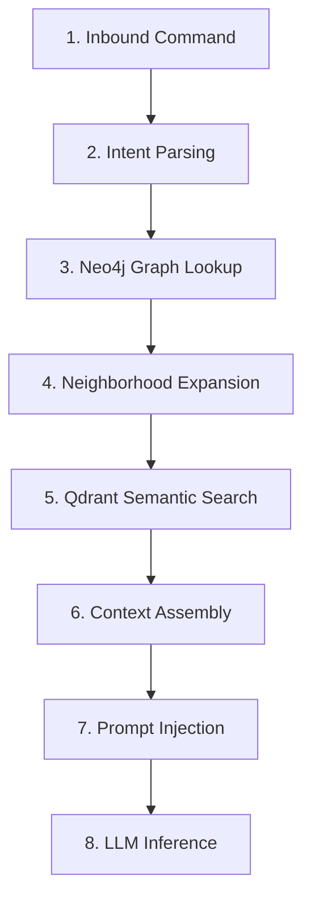

# Antygravity Agent Specifications & Memory Architecture

## 1. Executive Summary

Antygravity is a next-generation AI coding agent specifically engineered to autonomously navigate, comprehend, and edit massive codebases (exceeding 1,000,000 lines of code). 

Traditional LLM coding agents fail when operating on large repositories due to context window limits, token exhaustion, and dilution of query relevance. Antygravity overcomes these constraints by employing a **Graph-Augmented Retrieval-Augmented Generation (GraphRAG)** system. By maintaining a cognitive hierarchy that partitions codebase structural mappings (Neo4j) and semantic chunk vectors (Qdrant), Antygravity surgically builds local, token-optimized context packages (typically < 15,000 tokens) to solve complex coding tasks without loading entire directories into prompt windows.

---

## 2. Core Capabilities

- **AST-Aware Code Exploration**: Navigates classes, methods, imports, database schemas, and API handlers by traversing code syntax trees rather than using raw string regex searches.
- **Deep Semantic Association**: Correlates conceptually related files (e.g., matching a React form component to its corresponding backend FastAPI router validation logic) even if they are structurally distant.
- **Strict Context Budgeting**: Prunes irrelevant information using ranking models, ensuring high-density, low-token input prompts that minimize LLM hallucinations.
- **Self-Healing Execution Memory**: Logs outcomes of past edits, bug repairs, and feedback loops to prevent regression errors.

---

## 3. The 4-Tier Memory System

To replicate the cognitive processes of a senior staff engineer, Antygravity segregates its memory into four distinct layers, each operating on a different timescale and storage medium:

```
  ┌────────────────────────────────────────────────────────┐
  │              3.1 Session Memory (Short-Term)           │
  │  - Context: Active files, terminal log, active task    │
  │  - Storage: Redis / Fastify In-Memory State            │
  └──────────────────────────┬─────────────────────────────┘
                             ▼
  ┌────────────────────────────────────────────────────────┐
  │              3.2 Project Memory (Mid-Term)             │
  │  - Context: AST Node graph & Semantic chunk embeddings │
  │  - Storage: Neo4j (Structural) + Qdrant (Semantic)     │
  └──────────────────────────┬─────────────────────────────┘
                             ▼
  ┌────────────────────────────────────────────────────────┐
  │           3.3 Architectural Memory (Long-Term)         │
  │  - Context: Style guides, design limits, frameworks    │
  │  - Storage: Persistent JSON Cache / SQLite tables      │
  └──────────────────────────┬─────────────────────────────┘
                             ▼
  ┌────────────────────────────────────────────────────────┐
  │            3.4 Execution Memory (Experience)           │
  │  - Context: Past edits, fixed bugs, PR history logs    │
  │  - Storage: Graph relationship nodes in Neo4j          │
  └────────────────────────────────────────────────────────┘
```

### 3.1. Session Memory (Short-Term)
- **Purpose**: Tracks immediate conversational state and the active execution step.
- **Contents**:
  - The active user instruction (e.g., *"Add authentication to the `/users/export` endpoint"*).
  - List of active file handles currently open in the IDE workspace.
  - Recent compiler errors, lint issues, and test execution outputs.
  - The step-by-step execution task checklist (`task.md`).
- **Storage**: In-memory state (Fastify/Redis cache). Destroyed or archived upon session closure.

### 3.2. Project Memory (Mid-Term)
- **Purpose**: Codebase structure and semantic understanding.
- **Contents**:
  - **Structural Sub-Layer**: Complete Abstract Syntax Tree (AST) entity maps. Nodes represent files, classes, methods, endpoints, database schemas, and global configuration values.
  - **Semantic Sub-Layer**: High-dimensional vector embeddings of individual code fragments (functions, type definitions) with associated AST metadata.
- **Storage**: 
  - Structural data: **Neo4j** graph database.
  - Semantic vectors: **Qdrant** vector store.

### 3.3. Architectural Memory (Long-Term)
- **Purpose**: Encodes team-wide design conventions, patterns, and absolute constraints.
- **Contents**:
  - Technical guidelines: *"We use vanilla CSS for component styles; do not write Tailwind classes."*
  - Data access patterns: *"All database actions must route through the Repository layer."*
  - Security policies: *"Never implement custom crypto; always use the `CryptographyHelper` utility."*
- **Storage**: Relational rows in SQLite or persistent JSON configuration rules.

### 3.4. Execution Memory (Experience)
- **Purpose**: Chronological log of previous adjustments and their downstream impacts.
- **Contents**:
  - Historical changes: *"In session sess_a3d2, we attempted to use UUIDs for session primary keys in SQLite, which caused a 40% performance degradation. Reverted to auto-incrementing integers."*
  - Bug fixes: Record of modified files linked to past errors to avoid introducing regressions.
- **Storage**: Neo4j event-link nodes connecting modified files to transaction-log elements.

---

## 4. Agent Reasoning: Inbound Query Pipeline

When the AgentOS Lead Developer agent receives a command: *"Implement password reset validation in our registration flow,"* it runs the following pipeline:



### 4.1. Step-by-Step Walkthrough

1. **Intent Parsing**: Extracts key semantic targets (e.g., `password reset`, `validation`, `registration`).
2. **Graph Lookup**: Queries Neo4j for entry point nodes matching the targets:
   ```cypher
   MATCH (f:Function) WHERE f.name CONTAINS "register" OR f.name CONTAINS "validate"
   RETURN f.name, f.filePath
   ```
3. **Neighborhood Expansion**: Performs a 2-hop traversal to retrieve dependent nodes:
   - Caller functions: `[:CALLS]`
   - Module imports: `[:IMPORTS]`
   - Implemented schemas: `[:IMPLEMENTS]`
4. **Semantic Search**: Queries Qdrant using similarity matching for conceptually aligned utilities (e.g., password hashing rules) across the repository.
5. **Context Assembly**: Consolidates the retrieved fragments. It replaces complete 5,000-line source files with focused code snippets (e.g., the 40-line `validateUser` function and the schema file).
6. **Prompt Injection**: Injects the assembled context into the predefined prompt template.

---

## 5. Prompt Injection Template

This template illustrates how the 4-tier memory is injected into the LLM system prompt:

```markdown
You are an expert AI software developer agent executing a task in a large codebase.

=== 1. SYSTEM CONSTRAINTS (ARCHITECTURAL MEMORY) ===
- All database queries must run through the Repository layer.
- Do not add third-party dependencies unless explicitly approved.
- Use async/await syntax for all server communication.

=== 2. WORKSPACE CONTEXT (PROJECT MEMORY) ===
Files under review:
[file: /backend/models/user.py]
```python
class UserRegistrationDTO(BaseModel):
    email: str
    password: str
```

Related methods discovered via GraphRAG:
```python
def validate_password_complexity(pwd: str) -> bool:
    return len(pwd) >= 8 and any(c.isdigit() for c in pwd)
```

=== 3. PAST EXECUTION LOGS (EXECUTION MEMORY) ===
- Session sess_8d3e: Modified UserRegistrationDTO to add email format validation.
- Session sess_9f2a: Fixed issue where password complexity was bypassed in mobile registration.

=== 4. CURRENT GOAL (SESSION MEMORY) ===
Active Task: Add password strength validation to the registration controller.
Workspace Open Files: [/backend/controllers/auth.py]

Please write the code changes in diff format.
```

---

## 6. Self-Healing loops

After executing code modifications, Antygravity triggers self-healing verification:
- **Lint/Compile Check**: Runs linter and compiler against modified files. If an error is returned, the compiler log is injected into the **Session Memory**, and the agent attempts to fix the error.
- **Unit Test Evaluation**: Spawns test suites related to the changed files.
- **Experience Logging**: If the tests pass, the action is marked as successful and logged to the **Execution Memory** (Experience Layer) for future context. If the test fails repeatedly, the failure pattern is logged as a caution node to warn future agents against attempting the same implementation path.

---

## 🔗 Related Documentation

- [`README.md`](file:///Users/rishabhshevde/My%20Projects/AgentOS/README.md) - Project overview and quick start.
- [`design.md`](file:///Users/rishabhshevde/My%20Projects/AgentOS/design.md) - Deep dive into GraphRAG engineering (Neo4j & Qdrant configurations).
- [`Agents.md`](file:///Users/rishabhshevde/My%20Projects/AgentOS/Agents.md) - Agent lifecycle, roles, and communication protocols.
- [`Brain.md`](file:///Users/rishabhshevde/My%20Projects/AgentOS/Brain.md) - Core backend brain execution architecture.

<small>Last updated: August 22, 2026 • Version 1.2.0</small>
