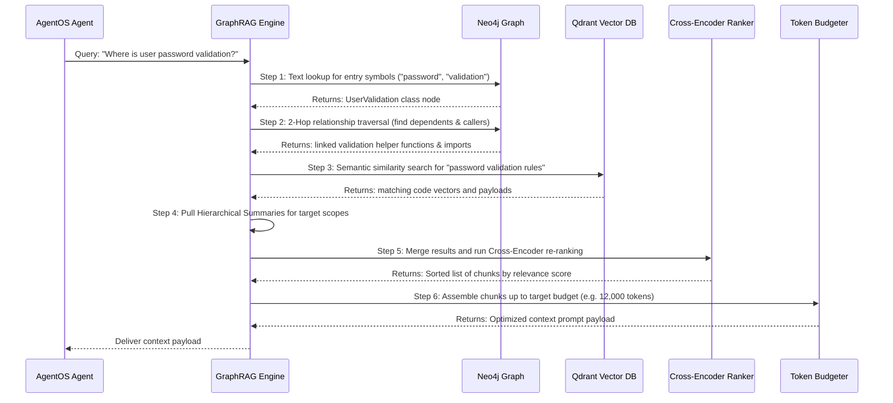

# 🧠 Antygravity GraphRAG Memory Engine

> The cognitive foundation enabling AgentOS agents to navigate and edit million-line codebases.

Antygravity is a production-grade Graph-Augmented Retrieval-Augmented Generation (GraphRAG) memory system designed to empower AgentOS agents with deep, context-aware understanding of large-scale repositories. While AgentOS coordinates agents to plan business goals, Antygravity provides the execution layer (like the Lead Developer agent) with the capability to surgically search, understand, and modify code within large directories—all while maintaining a clean, token-efficient prompt budget.

---

## 🔗 How Antygravity Empowers AgentOS

In the AgentOS ecosystem:
- **AgentOS** (orchestration layer): Directs agent lifecycles, manages WebSocket-based real-time broadcasts, and handles message logs between agents.
- **Antygravity GraphRAG** (memory layer): Provides the semantic and structural code search index.

When an AgentOS developer agent needs to add or edit code, it queries Antygravity:
1. **Analyze Intent**: Identifies the code symbols and semantic concepts in the request.
2. **Context Retrieval**: Runs structural and similarity searches to pull relevant code snippets (< 15,000 tokens).
3. **Prompt Injection**: Injects context into the agent's prompt, ensuring the generated code aligns with project conventions.

---

## 🏗️ Layered Architecture

Antygravity employs a decoupled, four-layer architecture to enable fast, hybrid retrieval:

```
  ┌────────────────────────────────────────────────────────┐
  │                 1. Structural Layer (Neo4j)            │
  │  - Graph mapping of file imports, calls, classes       │
  └──────────────────────────┬─────────────────────────────┘
                             ▼
  ┌────────────────────────────────────────────────────────┐
  │                 2. Semantic Layer (Qdrant)             │
  │  - High-dimensional vector embeddings of AST chunks    │
  └──────────────────────────┬─────────────────────────────┘
                             ▼
  ┌────────────────────────────────────────────────────────┐
  │         3. Hierarchical Summarization Layer            │
  │  - Map-Reduce summary blocks (Function -> File -> Repo)│
  └──────────────────────────┬─────────────────────────────┘
                             ▼
  ┌────────────────────────────────────────────────────────┐
  │                 4. Hybrid Retrieval Pipeline           │
  │  - Graph walk + vector search + ranker + token slicing │
  └────────────────────────────────────────────────────────┘
```

### 1. Structural Layer (Neo4j Graph Database)
Encodes the exact syntax relationships within the codebase.

#### Schema Nodes
- **`Folder`**: Directory structures. Attributes: `path`.
- **`File`**: Code files. Attributes: `path`, `language`, `hash` (MD5/SHA-256 code state).
- **`Class`**: Class structures. Attributes: `name`, `startLine`, `endLine`.
- **`Function`/`Method`**: Executable blocks. Attributes: `name`, `startLine`, `endLine`, `signature`.
- **`Interface`/`Type`**: Data contracts. Attributes: `name`.
- **`ApiRoute`**: REST/WS endpoints. Attributes: `path`, `method`.
- **`DbTable`**: DB schemas. Attributes: `tableName`, `fields`.
- **`EnvVar`**: Configuration variables. Attributes: `name`.

#### Schema Relationships
- `(Folder)-[:CONTAINS]->(File)`
- `(File)-[:CONTAINS]->(Class|Function|Interface)`
- `(Class)-[:CONTAINS]->(Method)`
- `(File)-[:IMPORTS]->(File|Dependency)`
- `(Function|Method)-[:CALLS]->(Function|Method)`
- `(Class)-[:IMPLEMENTS|EXTENDS]->(Interface|Class)`
- `(Function|Method)-[:EXPOSES]->(ApiRoute)`
- `(Function|Method)-[:MODIFIES_TABLE]->(DbTable)`
- `(Function|Method)-[:USES_VAR]->(EnvVar)`

---

### 2. Semantic Layer (Qdrant Vector Database)
Captures the semantic intent behind code blocks.

- **Vector Dimension**: 1536 dimensions (using `text-embedding-3-small` or equivalent).
- **Distance Metric**: Cosine Similarity.
- **Collection Name**: `code_chunks`.
- **Vector Payload Structure**:
  ```json
  {
    "file_path": "/backend/controllers/auth.py",
    "symbol_name": "validate_jwt_signature",
    "symbol_type": "function",
    "start_line": 42,
    "end_line": 86,
    "code_content": "def validate_jwt_signature(token: str) -> dict:\n...",
    "docstring": "Decodes and verifies signature of incoming JWT tokens."
  }
  ```

#### AST-Aligned Chunking Strategy
- **Syntax Boundaries**: Rather than splitting files by arbitrary character limits, code is parsed using language-specific **Tree-sitter** grammars to extract complete logical nodes (classes, functions).
- **Surrounding Scope**: Chunks include class definitions and imports to preserve context.
- **Languages Supported**: Python, TypeScript, JavaScript, Go, Rust, Java, C++, C#.

---

### 3. Hierarchical Summarization Layer
Creates multi-level summaries to allow agents to understand the repository at varying levels of abstraction:

```
  ┌────────────────────────────────────────────────────────┐
  │                 Level 4: Repository Summary            │
  │  "FastAPI auth backend connecting to PostgreSQL db."   │
  └──────────────────────────▲─────────────────────────────┘
                             │
  ┌──────────────────────────┴─────────────────────────────┐
  │                 Level 3: Folder Summary                │
  │  "Contains all core route controllers and handlers."   │
  └──────────────────────────▲─────────────────────────────┘
                             │
  ┌──────────────────────────┴─────────────────────────────┐
  │                 Level 2: File Summary                  │
  │  "Handles JSON Web Token creation and validations."    │
  └──────────────────────────▲─────────────────────────────┘
                             │
  ┌──────────────────────────┴─────────────────────────────┐
  │                 Level 1: Function Summary              │
  │  "Validates encryption parameters and payload exp."    │
  └────────────────────────────────────────────────────────┘
```

- **Update Pattern**: Summaries are updated incrementally when file modifications are detected by checking file hashes.
- **Map-Reduce Flow**: Leaf function summaries are merged to create file summaries, which roll up to folder and repository summaries.

---

### 4. Hybrid Retrieval Pipeline (6-Step Engine)



#### Step 5: Relevance Ranking Algorithm
Candidate chunks from graph traversal ($C_G$) and semantic searches ($C_S$) are merged. Each chunk $c$ is assigned a relevance score:

$$Score(c) = w_1 \cdot Sim(c, q) + w_2 \cdot Hops(c) + w_3 \cdot Recency(c)$$

Where:
- $Sim(c, q)$: Cosine similarity between chunk vector and query vector.
- $Hops(c)$: Inverse path distance in Neo4j to the main entry point node.
- $Recency(c)$: Boost factor based on git commit history updates.
- Weights: $w_1 = 0.50$, $w_2 = 0.35$, $w_3 = 0.15$.

#### Step 6: Token Budgeting & Slicing
- **Target Prompt Limit**: 12,000 to 15,000 tokens.
- **Preservation Protocol**: The entry point node and direct dependencies (1-hop) are locked. Remaining budget is filled using re-ranked chunks until the threshold is met, pruning lower-priority files.

---

## ⚙️ Ingestion & Processing Pipeline

The ingestion pipeline runs as a background service:

1. **File Watcher**: Listens for file changes (`create`, `modify`, `delete`) using system watchers (e.g. `fswatch` or `watchfiles`).
2. **Incremental Indexing**: Calculates file hash (SHA-256) and compares it with the database. If unchanged, the step terminates.
3. **AST Parsing**: Passes modified files to the Tree-sitter parser, building structural nodes and relationships.
4. **Graph Upsert**: Executes Cypher `MERGE` queries in Neo4j to update nodes and associations.
5. **Vector Ingestion**: Generates chunk embeddings and uploads them to Qdrant.
6. **Summary Generation**: Updates hierarchical summaries for changed nodes.

---

## 🚀 Performance Targets

Antygravity is optimized for quick feedback loops:

| Metric | Target | Verification Method |
| --- | --- | --- |
| **Max Repo Scale** | 1,000,000+ Lines of Code | Synthetic test repository validation |
| **Graph Traversal Latency** | < 120ms (2-hop queries) | Automated Cypher query profiling |
| **Qdrant Search Latency** | < 80ms (ANN search) | Vector retrieval benchmarking |
| **Ingestion Speed** | 600 files per minute | Ingestion benchmark testing |
| **Retrieval Payload Size** | < 12,000 tokens (avg) | Output payload token counting |

---

## 🔮 Future Enhancements

- **Temporal Git Analysis**: Index commit histories to allow queries like *"Find functions modified in the last 3 PRs related to OAuth"*.
- **Change Impact Prediction**: Run graph traversals to predict downstream impacts before modifying code.
- **Natural Language Codebase Walkthrough**: Allow agents to request an interactive walkthrough of unfamiliar directories.

---

## 🔗 Related Documentation

- [`README.md`](README.md) - Project overview and quick start.
- [`agent.md`](agent.md) - Specifications on agent architecture, lifecycle, and memory systems.
- [`Brain.md`](Brain.md) - Orchestration brain and synthesis flows.

<small>Last updated: August 22, 2026 • Version 1.2.0</small>